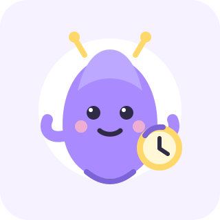
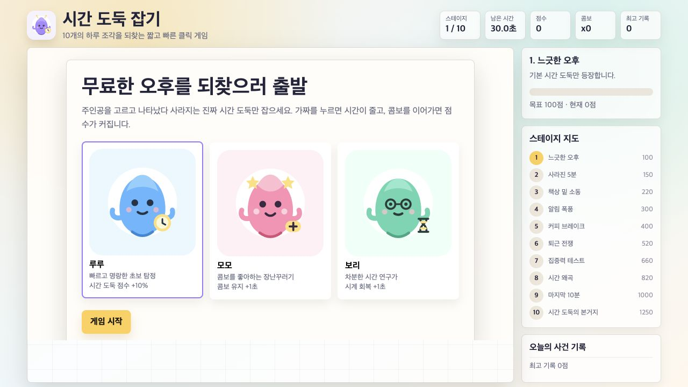
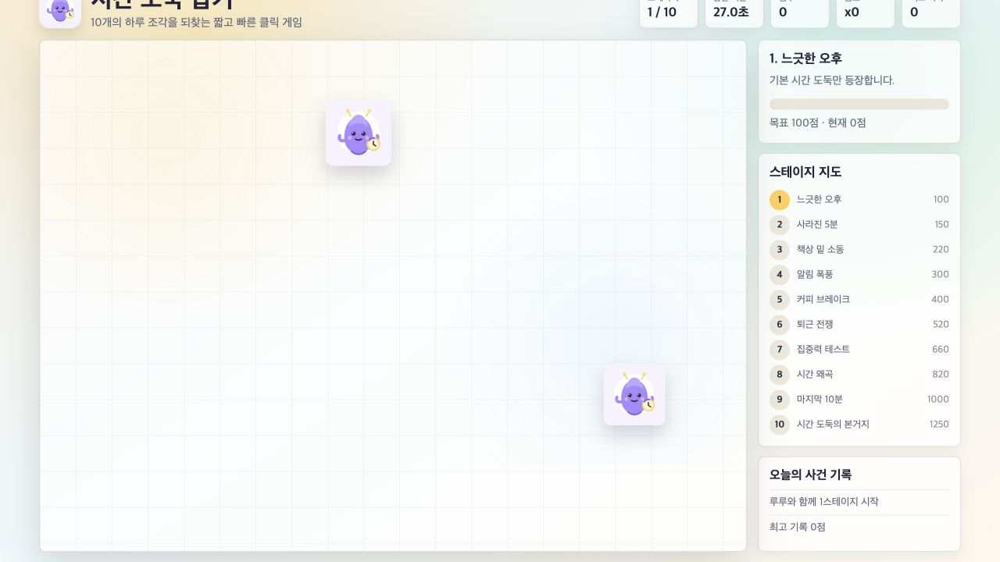

# kill-time
심심풀이 web 게임 만들기

## 추천 게임: 시간 도둑 잡기

`kill-time`이라는 프로젝트 이름에 맞춰, 짧은 시간 동안 가볍게 즐길 수 있는 반응형 웹 게임을 만듭니다.

### 게임 시나리오

플레이어는 무료한 오후를 보내던 중, 화면 곳곳에 숨어 있는 `시간 도둑`들이 하루의 여유 시간을 훔쳐 가고 있다는 사실을 알게 됩니다. 10개의 스테이지를 지나며 제한 시간 안에 나타났다 사라지는 시간 도둑을 클릭해 붙잡고, 동시에 도움이 되는 아이템을 모아 최대한 많은 시간을 되찾아야 합니다.

시간 도둑은 스테이지가 진행될수록 더 빠르게 움직이고, 가짜 미끼와 방해 요소도 함께 등장합니다. 플레이어는 순발력과 집중력을 발휘해 진짜 시간 도둑만 골라 잡아야 하며, 잘못 클릭하면 남은 시간이 줄어듭니다.

### 대표 캐릭터

#### 시간 도둑 틱

`틱`은 사람들의 자투리 시간을 몰래 주워 작은 시계 가방에 모으는 장난꾸러기 캐릭터입니다. 동글동글한 보라색 몸과 볼터치가 특징이며, 화면 곳곳에 나타났다가 플레이어가 클릭하기 전에 톡 하고 도망칩니다.

- 이름: 틱
- 역할: 기본 시간 도둑 캐릭터
- 성격: 재빠르고 장난기 많지만 미워할 수 없이 귀엽습니다.
- 특징: 둥근 몸, 작은 더듬이, 볼터치, 시계 가방
- 게임 내 동작: 등장, 숨기, 도망가기, 시계 가방 흔들기, 잡혔을 때 깜짝 놀라기

### 주인공 캐릭터 선택

게임 시작 화면에서 플레이어는 3명의 주인공 중 하나를 선택합니다. 캐릭터마다 작은 보너스 능력이 있어, 같은 스테이지라도 다른 플레이 감각으로 즐길 수 있습니다.

| 캐릭터 | 이미지 | 성격 | 보너스 능력 |
| --- | --- | --- | --- |
| 루루 |  | 빠르고 명랑한 초보 탐정 | 시간 도둑 클릭 점수 +10% |
| 모모 |  | 콤보를 좋아하는 장난꾸러기 | 콤보 유지 시간이 1초 증가 |
| 보리 |  | 차분한 시간 연구가 | 시계 아이템 회복 시간 +1초 |

### 핵심 규칙

- 게임은 총 10개 스테이지로 구성됩니다.
- 게임 시작 시 주인공 캐릭터 1명을 선택합니다.
- 각 스테이지의 제한 시간은 30초입니다.
- 목표 점수를 달성하면 다음 스테이지로 이동합니다.
- 시간 도둑을 클릭하면 점수를 얻습니다.
- 시계 아이템을 클릭하면 남은 시간이 조금 늘어납니다.
- 가짜 도둑을 클릭하면 시간이 감소합니다.
- 연속으로 정확히 클릭하면 콤보 점수가 올라갑니다.
- 시간이 끝나기 전에 목표 점수를 채우지 못하면 게임 오버입니다.
- 10스테이지를 클리어하면 최종 점수와 최고 기록을 보여줍니다.

### 스테이지 구성

| 스테이지 | 이름 | 목표 | 주요 변화 |
| --- | --- | --- | --- |
| 1 | 느긋한 오후 | 100점 | 기본 시간 도둑만 등장합니다. |
| 2 | 사라진 5분 | 150점 | 시간 도둑이 조금 더 빨리 사라집니다. |
| 3 | 책상 밑 소동 | 220점 | 가짜 도둑이 처음 등장합니다. |
| 4 | 알림 폭풍 | 300점 | 방해 알림이 화면 일부를 잠깐 가립니다. |
| 5 | 커피 브레이크 | 400점 | 시계 아이템이 등장해 시간을 회복할 수 있습니다. |
| 6 | 퇴근 전쟁 | 520점 | 시간 도둑이 움직이면서 등장합니다. |
| 7 | 집중력 테스트 | 660점 | 가짜 도둑의 비율이 증가합니다. |
| 8 | 시간 왜곡 | 820점 | 일부 도둑은 클릭 직전에 위치가 바뀝니다. |
| 9 | 마지막 10분 | 1000점 | 제한 시간이 더 빠르게 줄어드는 구간이 생깁니다. |
| 10 | 시간 도둑의 본거지 | 1250점 | 모든 패턴이 섞여 등장하는 최종 스테이지입니다. |

### 재미 요소

- 스테이지별 목표가 있어 짧은 플레이에도 진행감이 있습니다.
- 도둑의 이동 속도와 등장 패턴이 점점 어려워집니다.
- 각 스테이지마다 새로운 방해 요소가 추가되어 단조롭지 않습니다.
- 최고 기록 저장으로 재도전 동기를 줍니다.
- 모바일과 데스크톱 모두에서 클릭 또는 터치로 쉽게 플레이할 수 있습니다.

## 구현 완료

`시간 도둑 잡기`는 정적 HTML 웹 게임으로 구현되었습니다. 별도 빌드 과정 없이 `index.html`을 브라우저에서 열어 바로 플레이할 수 있습니다.

### 실행 방법

아래 임베딩 페이지를 열면 `index.html`이 렌더링되어 바로 게임 화면이 보입니다.

- [시간 도둑 잡기 바로 플레이](https://htmlpreview.github.io/?https://github.com/bulgemi/kill-time/blob/main/index.html)

로컬에서 확인할 때는 저장소를 받은 뒤 [`index.html`](index.html) 파일을 더블 클릭해도 됩니다.

### 구현 파일

- 최종 선택 게임: `index.html`
- 비교 후보 구현: `candidates/agent1/index.html`, `candidates/agent2/index.html`, `candidates/agent3/index.html`, `candidates/agent4/index.html`
- 사용 에셋: `assets/time-thief.svg`, `assets/hero-ruru.svg`, `assets/hero-momo.svg`, `assets/hero-bori.svg`
- 검증 스크린샷: `screenshots/final-start.png`, `screenshots/final-playing.png`

### 구현된 기능

- 루루, 모모, 보리 중 주인공을 선택하고 캐릭터별 보너스를 적용합니다.
- 10개 스테이지와 목표 점수, 30초 제한 시간을 반영했습니다.
- 시간 도둑, 가짜 도둑, 시계 아이템이 단계별로 등장합니다.
- 알림 방해, 움직이는 도둑, 순간 이동 도둑, 빠른 시간 감소 구간을 구현했습니다.
- 연속으로 정확히 클릭하면 콤보 점수가 증가합니다.
- 최고 기록은 브라우저 `localStorage`에 저장됩니다.
- 데스크톱 클릭과 모바일 터치 입력을 모두 지원합니다.

### 최종 선택 기준

4개의 후보 구현을 만든 뒤, 시나리오 반영도, 실제 플레이 안정성, 화면 구성, 진행감 기준으로 비교했습니다. 최종 선택본은 스테이지 지도와 사건 기록 UI가 있어 게임의 진행 상황과 README의 시나리오가 가장 잘 드러나는 구현입니다.

### 화면 예시

